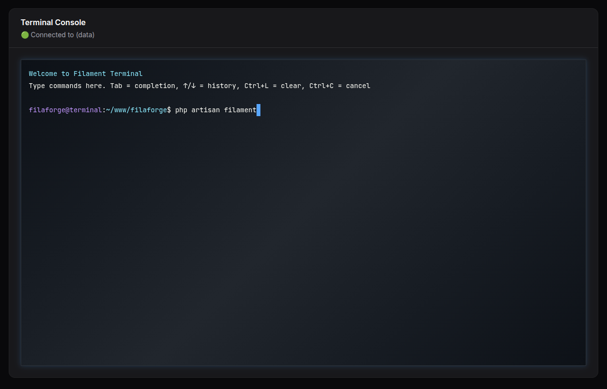

# Filaforge Terminal Console

A Filament v4 panel plugin that provides a browser-based terminal p## Usage

After installation and registration, you'll find the "Terminal Console" page in your Filament panel navigation. The terminal provides:

- **Interactive Terminal**: Full xterm.js-powered terminal interface
- **Welcome Message**: Automatically displays on page load
- **Command Allowlist**: Only safe, pre-approved commands can be executed
- **Real-time Output**: See command results immediately
- **SPA Navigation**: Works seamlessly with Filament's single-page application

Navigate to your Filament panel and look for "Terminal Console" in the sidebar. The terminal will automatically initialize with a welcome message and command prompt.

## Configuration

The plugin includes a command allowlist for security. You can customize the allowed commands by publishing the configuration:

```bash
php artisan vendor:publish --tag="terminal-console-config"
```

This will create a `config/terminal-console.php` file where you can modify the allowed commands list.

## Security Notes

- **Allowlist Only**: The terminal only executes commands from a predefined allowlist
- **No Root Access**: Commands run with the same permissions as your web server
- **Safe Defaults**: The default allowlist includes only safe, informational commands

## Features

- ✅ Browser-based terminal powered by xterm.js
- ✅ Automatic initialization on page load
- ✅ Command allowlist for security
- ✅ Real-time command output
- ✅ SPA-compatible navigation
- ✅ Responsive design matching Filament's theme

---

**Package**: `filaforge/terminal-console`  
**License**: MIT  
**Requirements**: PHP ^8.1, Laravel ^12, Filament ^4.0y an allowlist of safe server commands.



## Requirements
- PHP >= 8.1
- Laravel 12 (illuminate/support ^12)
- Filament ^4.0

## Installation

### Step 1: Install via Composer
```bash
composer require filaforge/terminal-console
```

### Step 2: Service Provider Registration
The service provider is auto-discovered, so no manual registration is required.

### Step 3: Register the Plugin in Your Panel
Add the plugin to your Filament panel configuration in `app/Providers/Filament/AdminPanelProvider.php` (or your custom panel provider):

```php
<?php

namespace App\Providers\Filament;

use Filament\Http\Middleware\Authenticate;
use Filament\Http\Middleware\DisableBladeIconComponents;
use Filament\Http\Middleware\DispatchServingFilamentEvent;
use Filament\Pages;
use Filament\Panel;
use Filament\PanelProvider;
use Filament\Support\Colors\Color;
use Filament\Widgets;
use Illuminate\Cookie\Middleware\AddQueuedCookiesToResponse;
use Illuminate\Cookie\Middleware\EncryptCookies;
use Illuminate\Foundation\Http\Middleware\VerifyCsrfToken;
use Illuminate\Routing\Middleware\SubstituteBindings;
use Illuminate\Session\Middleware\AuthenticateSession;
use Illuminate\Session\Middleware\StartSession;
use Illuminate\View\Middleware\ShareErrorsFromSession;

// Add this import
use Filaforge\TerminalConsole\TerminalConsolePlugin;

class AdminPanelProvider extends PanelProvider
{
    public function panel(Panel $panel): Panel
    {
        return $panel
            ->default()
            ->id('admin')
            ->path('admin')
            ->login()
            ->colors([
                'primary' => Color::Amber,
            ])
            ->discoverResources(in: app_path('Filament/Resources'), for: 'App\\Filament\\Resources')
            ->discoverPages(in: app_path('Filament/Pages'), for: 'App\\Filament\\Pages')
            ->pages([
                Pages\Dashboard::class,
            ])
            ->discoverWidgets(in: app_path('Filament/Widgets'), for: 'App\\Filament\\Widgets')
            ->widgets([
                Widgets\AccountWidget::class,
                Widgets\FilamentInfoWidget::class,
            ])
            ->middleware([
                EncryptCookies::class,
                AddQueuedCookiesToResponse::class,
                StartSession::class,
                AuthenticateSession::class,
                ShareErrorsFromSession::class,
                VerifyCsrfToken::class,
                SubstituteBindings::class,
                DisableBladeIconComponents::class,
                DispatchServingFilamentEvent::class,
            ])
            ->authMiddleware([
                Authenticate::class,
            ])
            // Add the plugin here
            ->plugin(TerminalConsolePlugin::make());
    }
}
```

### Step 4: Clear Cache and Discover Assets
```bash
php artisan config:clear
php artisan route:clear
php artisan view:clear
```

## Usage
Open the “Terminal Console” page. On load, the terminal prints a welcome message and shows the prompt. Type an allowlisted command and press Enter.

## Notes
- The terminal uses xterm.js under the hood and enforces an allowlist for security.
- SPA navigation is handled; the terminal auto-initializes on first visit.

---
Package: `filaforge/terminal-console`## Filaforge Terminal Console

Run allowlisted console commands from a Filament page.

Usage:

```php
->plugin(\Filaforge\TerminalConsole\TerminalConsolePlugin::make())
```

Configure allowlist in `config/terminal.php` (published by the package).

